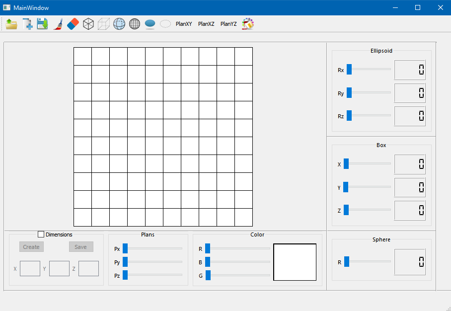

# PROJETO ESCULTURA 3D

## Descrição do Projeto

O projeto trata-se de um simples programa que através de uma matriz é possível desenhar pequenos pixels no plano, para visualizar as faces de um desenho 3D, em seguida gerar um arquivo .off de toda a estrutura 3D.

 

<h4 align="center"> 
	🚧  Projeto ESCULTURA 3D 🚀 Em construção...  🚧
</h4>
 

 <a href="#-Fatures">Fatures</a> •
 <a href="#-pre-requsitos">Pré-requisitos</a> • 
 <a href="#-tecnologias">Tecnologias</a> • 
 <a href="#-contribuicao">Contribuição</a> • 
 <a href="#-autor">Autor</a>

 

## 📃 Como Funcinona

O usuario pode ultilizar de sua imaginação para desenhar o que quiser no quadro branco, veja mais detalhes do programa a seguir:

- ## 1° Selecione as dimensões da matriz de desenho
- ## 2° Selecione as cores dos pixels no formato RGB 
- ## 3° Use o mouse para desenhar na matriz branca (use a criatividade 😉)
- ## 4° Aperte em salvar desenho para obter um arquivo no formato .off

<h1 align="center">
  
</h1>

 

## 💻 Pré-requisitos

Antes de começar, você vai precisar de um editor em C++ e um compilador:
[Qt](https://qt.io/). 

## 🎲 Rodando o projeto
### Veja esse vídeo mosrtando o projeto e suas funcionalidades

 

## 🛠️ Tecnologias

As seguintes ferramentas foram usadas na construção do projeto:

- [C++]()
- [MashLab](https://www.meshlab.net/#download)
- [Doxygen](https://www.doxygen.nl/manual/install.html)
- [Qt](https://qt.io/)

## 📫 Contribuindo para *PROJETO ESCULTURA 3D*

Para contribuir com o projeto, siga estas etapas:

1. Bifurque este repositório.
2. Crie um branch: `git checkout -b <nome_branch>`.
3. Faça suas alterações e confirme-as: `git commit -m '<mensagem_commit>'`
4. Envie para o branch original: `git push origin <nome_do_projeto> / <local>`
5. Crie a solicitação de pull.

Como alternativa, consulte a documentação do GitHub em [como criar uma solicitação pull](https://help.github.com/en/github/collaborating-with-issues-and-pull-requests/creating-a-pull-request).

## 👤 Autor
---
<table>
  <tr>
    <td align="center">
      <a href="https://github.com/lucasgf007">
         
        
          <a href="https://github.com/lucasgf007" title="Dev"><b>Lucas Gabriel 🚀</b></a>
        
      </a>
    </td>
    <td align="center">
      <a href="https://github.com/andreluizlimaa">
         
        
          <a href="https://github.com/andreluizlimaa" title="Dev"><b>André Lima 🚀</b></a>
        
      </a>
    </td>
  </tr>
</table>

